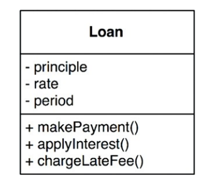

## Regras de Negócio
> *regras de negócio são políticas/procedimentos, geralmente automatizados, que
geram ou economizam dinheiro para a empresa*
- um cálculo de uma taxa é uma regra de negócio, seja ela feita por um caixa e
um ábaco em mãos, ou um sistema que automatiza isso.

### Entidades
- elemento contido no sistema que incorpora pequenos conjuntos de regras de
negócio

- quando implementam regras cruciais de negócio, passam a ser independente e
representa o negócio. não banco de dados, não interfaces de usuário ou
frameworks. ela é puro negócio e nada mais.

### Casos de Uso
- para regras que não são tão "puras" como as das entidades, os casos de uso
compilam pequenos procedimentos que também atendem o negócio. como por
exemplo:
  - sistema bancário que depende do preenchimento de determinadas
  informações do cliente para que ofereça então um empréstimo.

- entidades não sabem nada sobre os casos de uso, pois são de nível mais alto.
isso porque os casos de uso são específicos para uma aplicação, as entidades
dizem respeito a generalização de muitas aplicações

- os casos de uso dependem das entidades, e não o contrário

### Modelos de Requisição e Resposta
- os casos de uso recebem e produzem dados, entrada e saída. e não sabem
efetivamente como eles chegam ao usuário. esse é papel de uma camada de *view*,
geralmente uma interface *web* em um site ou um conjunto de estruturas de dados
no caso de uma **API**.
- evite a tentação de reutilizar entidades como respostas ou até mesmo modelo de
tabelas. entidades são negócio e geralmente são produzidas na entrada e saída
dos casos de uso. estruturas de dados de requisição/resposta devem ser
agnósticas disso
- estes objetos não devem ser reutilizados e podem violar o OCP e SRP,
resultando em *tramp code* e muitas condicionais no código.

## Conclusão
- regras de negócio são a razão da existência de um sistema de software, geram
valor e economizam dinheiro.
- essas regras devem ser imaculadas e manter-se puras. sendo agnósticas de *I/O*
e banco de dados. devem ser os trechos de código mais independentes e
reutilizáveis do código.

