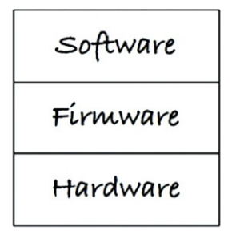
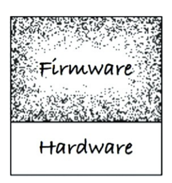
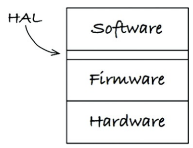

## Clean Embedded Architecture
- *embora o software não sofra desgastes, o firmware e o hardware se tornam
obsoletos, o que exige modificações no software* 
- *embora o sofware não sofra desgasts, ele pode ser destruído internamente por
dependências não ferenciadas de firmware e hardware*
- para que o software tenha vida longa e útil, é necessário separá-lo do
firmware e do hardware. ou seja, descoplar. o software deve ser um plug-in do
firmware

### Teste de App-tidão
- um sistema que recém passou por teste de app-tidão está apto a funcionar
unicamente no hardware a qual foi desenvolvido e compilado. isso é um problema.
- o software não terá vida longa e útil. talvez sequer compile num outro
ecossistema.

### O Gargalo de Hardware-alvo
- desenvolvedores de software embarcado têm mais preocupações como memória
limitada, I/O limitado, restrições em tempo real, interfaces de usuário não
convencionais etc. software embarcado é especial. mas não o suficiente para
impedir de aplicar os conceitos vistos neste livro.
- quando os princípios da arquitetura limpa não forem aplicados nesse tipo de
software, teremos um gargalo em que o software sendo desenvolvido será testado
apenas no hardware-alvo. isso causará atrasos

### Uma Arquitetura Limpa Embarcada é Uma Arquitetura Embarcada Testável
- como aplicar alguns princípios de arquitetura limpa em software e ao firmware
para eliminar o gargalo hardware-alvo

#### Camadas
- separando em camadas facilitará mover o firmware e o software para outro
hardware. caso contrário, teremos um antipadrão e os desenvolvedores terão que
atuar em testes de regressão manualmente.

- clean architecture:



- antipattern:



#### O Hardware é Um Detalhe
- uma das tarefas do desenvolvedor de software embarcado é separar *hard, firm e
soft e wares*. o ideal é aplicar o conceito de HAL (Hardware Abstraction
Layer). essa camada se trata de uma API que esconde os detalhes de firmware do
software.



### Não Revele Detalhes de Hardware para o Usuário da HAL
- a aplicação embarcada deve ser testável fora do hardware-alvo

#### O processador é um Detalhe
- para implementações com detalhes específicos de processador, uma forma de
abstrair é utilzando arquivos *headers*. quando houverem diferentes
especificações para processadores diferentes, haverá mais de um arquivo desse
tipo. os fontes que utilizarem esses detalhes não devem usar um ou outro
*header* e sim um único *header* que saiba qual dos dois utilizar. como uma
camada de abstração do processador (PAL).

```c
// acmetypes.h for ARM
#if defined (_ACME_ARM)
typedef unsigned int    UInt_32;
typedef unsigned short  UInt_16;
...
#elif defined (_ACME_AMD)
typedef unsigned int    UInt_64;
typedef unsigned short  UInt_32;
...
#else
  #error not supported
# endif
```

- utilize, por exemplo, `stdint.h`:

```c
// stdint.h for both, AMD or ARM
#ifndef _STDINT_H_
#define _STDINT_H_
#include <acmetypes.h>
typedef UInt_32  uint32_t;
typedef UInt_16  uint16_t;
...
#endif
```

#### O Sistema Operacional é um Detalhe
- para o software estar apto a ter vida longa e útil, talvez uma HAL não seja
suficiente. caso migre de um SO Linux para Windows, ou para um RTOS
- talvez seja importante adicionar uma nova camada, a de abstração do sistema
operacional (OSAL). dessa maneira, migrar para um novo SO facilite pois será uma
implementação, não mudanças e adaptações para atender ambos sistemas
- essa camada também fornece pontos chave na testabilidade for do SO


#### Programando para Interfaces e Substituibilidade
- aplique interfaces, no caso de software embarcados, arquivos *header* para
garantir a substituibilidade.
- não defina esses arquivos contendo estruturas de dados, constantes, novos
tipos (*typedef*). deixe claro que as implementações podem ser diferentes e
apenas as declarações de comportamentos são específicadas nesses arquivos.
- arquitetura limpa embarcada é testável dentro das camadas, pois os módulos
interagem através de interfaces.

#### Diretivas de Compilação Condicional DRY
- muito comum no C e C++, as declarações condicionais de compilação não podem e
não devem ser vistas *N* vezes no código. tal como compilar determinado bloco de
acordo com a versão de um firmware `#ifdef _ACME_AMD_V2_`. um HAL facilmente
resolveria esse problema, em que, essa camada seria a única responsável por
fornecer a implementação (sem conhecermos os detalhes) e centralizando essas
chamadas.
- isso é aplicar Don't Repeat Yourself (DRY), o software em si (regras de
negócio e a aplicação alvo) estará segura em simplesmente utilizar as funções
especificadas na HAL, sem se importar com a versão.

## Conclusão
- desenvolvedores de sistemas embarcados tem muito a aprender com as
experiências fora dessa área. este livro apresenta alguns conceitos cruciais
para longevidade da aplicação, também quanto a aplicabilidade em diferentes SOs
e Hardware

