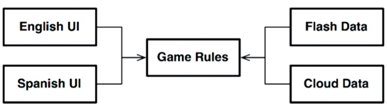
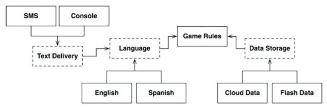
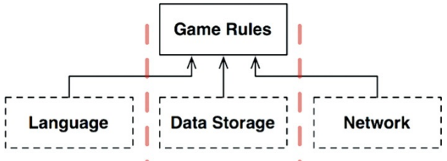
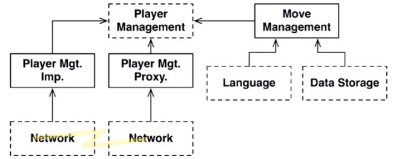

## Camadas e Limites

### Hunt he Wumpus
- um jogo simples, em, aplicando conceitos de boa arquitetura (nesse cenário
para o idioma da UI) então as regras do jogo não seriam impactadas por essa.
também não por diferentes maneiras de armazenamento. o diagrama a seguir
representa a aplicação da boa arquitetura

### Arquitetura Limpa?
- talvez o mecanismo de comunicação também precise ser orientado ao idioma,
propomos então o uso de uma API

- tendo as API's especificadas, podemos inicialmente ignorar suas
implementações polimórficas.

### Cruzando Fluxos
- nem sempre haverá um fluxo único, pode ser que o jogo também seja utilizado em
rede, necessidade de um novo fluxo para *Game Rules*

### Dividindo os Fluxos
- os fluxos nem sempre se encontram, num único componente. portanto, políticas
de níveis mais altos são mais importantes/determinísticas. por exemplo, uma
regra que gerencia a vida do jogador que nos leva a um novo limite arquitetural,
onde *Player Management* se trata de um microsserviço enquanto *Move Management*
é de utilização local do jogador.

## Conclusão
- com todo esse cenário/exemplo, temos que, como arquitetos, saber que limites
arquiteturais podem estar em qualquer lugar e quando implementados, se tornam
caros. ainda que, seja muito caro também incluir e implementar limites
arquiteturais posteriormente
- percepção da falta desses limites implementados da maneira correta/ideal é
crucial para um bom arquiteto, acompanhe o projeto e interprete onde
implementa-los e onde ignora-los. avalie os custos. revise a decisão
frequentemente.

