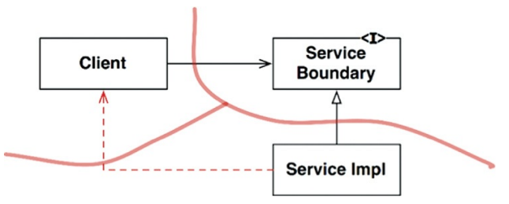
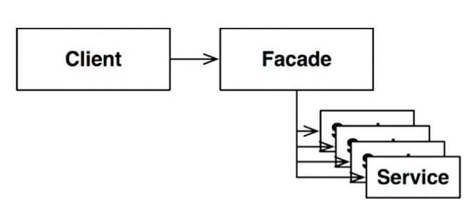

## Limites Parciais
- limites arquiteturais completamentos desenvolvidos são caros. necessitam de
interfaces "boundary" polimórficas recíprocas, estruturas de dados input e
output e toda gestão de dependência necessária para isolar os dois lados em
componentes independentemente compiláveis e implantáveis. isso requer muito
trabalho.
- para arquiteturas em que essa manutenção seja vista como "muito cara", pode se
optar pela implementação de limites parciais.

### Pule o Último Passo
- execute todo o procedimento para se desenvolver um novo componente,
separadamente da aplicação principal. descarte o passo de "componentizar" e
versionar o mesmo. tudo estará na aplicação, até mesmo interfaces de entrada e
saída.
- ele será acoplado a mesma aplicação, compilado e implantado. toda configuração
estará nele.
- o ganho é que todo esforço de se manter um novo componente serão reduzidos
ao custo de deixar de ser rastreável, implantável e sem gestão de múltiplos
componentes.

### Limites Unidimensionais
- o mais indicado é abrir mão desse custo inicial que é fazer um novo componente
e deixar sua implementação, apesar de integrada, de certa forma "desacoplada" e
evidente que há um limite arquitetural entre o módulo principal e o suposto
componente. o pattern DIP é seu aliado nessa tarefa.

### Fachadas (Facades)
- um limite ainda mais simples é o padrão de projeto *facade* (fachada) em que
até a inversão de dependência é sacrificada. contudo, no exemplo abaixo,
*Client* possui *N* dependências transitivas.

## Conclusão
- apresentamos 3 maneiras de se descartar a possibilidade de criar um novo
componente, que exigiria mais esforço de desenvolvimento e gestão.
- cada qual possui custos e benefícios, cabe ao arquiteto determinar quais
possíveis implementações poderiam vir a ser um novo componente e aplicar uma das
opções apresentadas. reduzindo esforços no início, e garantindo que haverá menos
esforço caso seja necessário, futuramente, componentizar efetivamente.

