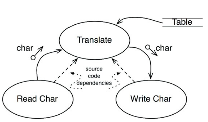
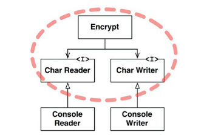

## Política e Nível
  - Sistemas de sofware são declarações de política. um conjunto de instruções
  que descreve detalhadamente a política de entradas e saídas.

### Nível
  - pode ser definida como "distância das entradas e saídas", pois, quanto mais
  distante uma política das entradas e saídas, maior o nível. as mais próximas
  se tratam de políticas de baixo nível.
  - conforme o exemplo abaixo temos a figura 19.1 e 19.2. a primeira aprensenta
  acoplamento entre *encrypt* e o *IO*. já a segunda está a salvo de mudanças no
  dispositivo.

  

  

## Conclusão
  - classes cujas políticas sejam de baixo nível devem ser feitas a serem usadas
  como plugin pelas de nível alto
  - SRP, OCP, CCP, DIP e outros são aplicados quando tratarmos de políticas e
  seus níveis.

