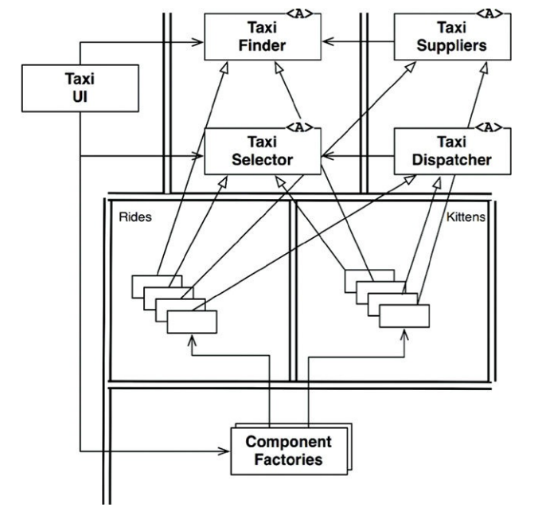
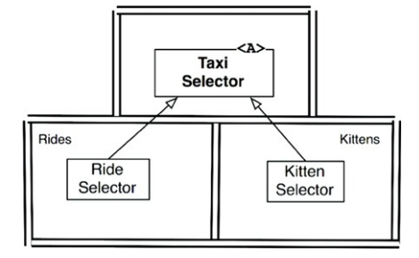

## Serviços: Grandes e Pequenos
- microsserviços oferecem algumas vantagens que denotam seu sucesso e sua
crescente de uso nos últimos anos:
  - serviços fortemente desacoplados
  - independência de desenvolvimento e implantação
- ambas afirmativas são parcialmente verdadeiras

### Arquitetura de Serviço?
- serviço não é necessariamente uma separação arquitetural, pois não estão
obrigatóriamente seguindo as premissas da arquitetura que é justamente gestão de
dependência, separação de detalhes conforme o nível e os tão falados limites.
- isso não indica que não haja arquitetura dentro de serviços, mas em geral
serão separados por responsabilidade, funcionaidades em processos e plataformas.
o que talvez não pareça inicialmente uma boa ideia tendo em vista o alto custo
de chamadas entre eles.

### Benefícios dos Serviços?
- dissecaremos aqui os benefícios já que anteriormente ficaram interrogações.

#### A Falácia do Desacoplamento
- não necessariamente serão desacoplados, dado que individualmente (em
variáveis, escopos, interfaces) são. mas podem estar fortemente acoplado, por
exemplo, ao processo.
- interfaces de API não são mais rigorosas que interfaces de funções. ou seja, o
benefício de desacomplamento é em partes, ilusão.

#### A Falácia do Desenvolvimento e da Implantação Independentes
- podem ser implantados e desenvolvidos separadamente, mas esse benefício também
não seja tão realista.
- dado que em determinado estágio em que processo seja interdependente. haverá,
fatalmente, a necessidade de coordenação de desenvolvimento, implantação e
operação. quebrando suposta independência.

### O Problema do Gato
- em resumo, um sistema de taxi passa por uma mudança *drástica* e passa a
entregar gatos. o sistema que anteriormente aceitava apenas passageiros agora
exige informações como "é alérgico a gatos?" para o cliente, já que, dentro de 3
dias um passageiro alérgico não poderá passar pelo mesmo veículo que um gato
esteve. numa arquitetura de serviços não terá como não lidar com todos os
serviços como ser fossem um só. mesmo estes sendo responsáveis por diferentes
tarefas e avaliações, passarão por uma coordenação de desenvolvimento,
implantação e operação.

### Objetos ao Resgate
- uma estratégia possível para solucionar o problema de novos recursos sendo
implementados em coexistência com os já existentes é o polimorfismo. na figura
27.2 veremos que a *UI* controla uma factory que direciona qual tipo de taxi
deve ser enviado ao solicitante - observe os limites.

### Serviços Baseados em Componentes
- idealmente novos recursos serão adicionados independentemente. pense como
novas implementações serem adicionadas como um .jar ao servidor da aplicação. a
aplicação no cenário atual já está apta a controlar os recusos de acordo com a
condicional. portanto, tudo que for adicionado não precisará passar por uma
"reimplantação total". é o conceito de OCP na arquitetura.

### Preocupações Transversais
- para lidar com as preocupações transversais, como a vista na seção [O
Problema do Gato](#o-problema-do-gato), podemos utilizar uma arquitetura de
componentes em conformidade com a Regra de Dependência, conforme o diagrama da
figura 27.7

## Conclusão
- por mais úteis que os serviços sejam para a escalabilidade e desenvolvimento
de um sistema, eles não são arquiteturalmente significantes. uma arquitetura de
sistema são limites e os elementos que cruzam estes limites. é mais orientada a
mecanismos físicos do que como se comunicam ou são executados.

