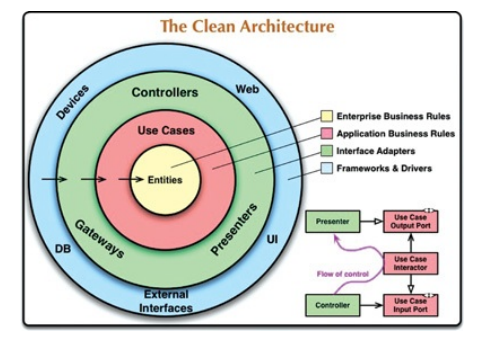
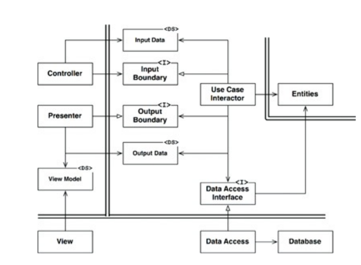

## A Arquitetura Limpa
- algumas ideias relacionadas a arquitetura surgiram no decorrer de alguns anos
e elas foram:
  - A Arquitetura Hexagonal (Ports and Adapters) de Alistair Cockburn e abordada
  por Steve Freeman e Nat Pryce no livro *Growing Object Oriented Software with
  Tests*
  - A DCI de James Coplien e Trygve Reenskaug
  - A BCE introduzida por Ivar Jacobson em seu livro *Object Oriented Software
  Engineering: A Use-Case Driven Approach*
- todas muito parecidas, apesar de cada uma com seus detalhes. todas realizam a
"separação de preocupações" e criam camadas. essas arquiteturas produzem
sistemas com as seguintes características:
  - Independência de frameworks
  - Testabilidade
  - Independência da UI
  - Independência do banco de dados
  - Independência de qualquer agência externa

- O seguinte diagrama tenta integrar todas as arquiteturas em uma só ideia:

### A Regra da Dependência
- na imagem anterior os círculos concêntricos representam as áreas do software.
quando mais interno, maior o nível do software. os mais externos são mecanismos
e os internos políticas.
- a regra é: *As dependências de código-fonte devem apontar apenas para dentro,
na direção das políticas de nível mais alto.*
- as partes se associam mas não se agrupam. os mais externos têm conhecimento
dos mais internos e ao mesmo tempo os internos não conhecem os mais externos.
- se associam como se os internos "alimentassem" os externos com detalhes dados,
estruturas
- não devem haver detalhes do externo no interno, a fim de não misturar casos de
uso/entidades de negócio com frameworks e implementações

### Entidades
- como já mencionado, são puro negócio. mudam somente quando o neǵocio muda. não
deve ser alterada por uma mudança em UI, por exemplo.
- podem ser usadas por *N* aplicações da empresa

### Casos de Uso
- são regras de neǵocio que comumente são aplicadas em alguma interação com o
cliente/usuário. não está acoplada as entidades, mas pode trabalhar as entidades
a fim de aplicar determinadas políticas.

### Adaptadores de Interface
- são os responsáveis por receber entidades e transformar em elementos para o
banco de dados, para a GUI, apresentadores, controladores... possui modelos que
estão limitados àquele módulo. e também o contrário, recebendo estruturas dos
agentes mais externos da camada e transformando em algo factível para os casos
de uso e entidades. 

### Frameworks e Drivers
- a camada mais externa dessa arquitetura não tem muito desenvolvimento,
geralmente se limita a configurações e associações para estabelecer as
comunicações com o círculo interno seguinte.

### Só Quatro Círculos?
- não se limita a quatro círculos, fica a cargo da arquitetura. do grau de
segregação aplicada no sistema.

### Cruzando Limites
- no canto inferior há um exemplo de como cruzar limites, em que os
apresentadores/controladores se comunicam com os casos de uso. em que o caso de
uso "Use Case Interactor" interage com o "Presenter" através da Inversão de
Dependência, com a interface "Use Case Output Port".
- **nenhum nome uma camada externa deve ser mencionado em camadas mais
internas**

### Quais Dados Cruzem os Limites
- geralmente estruturas de dados simples são os elementos que transitam entre
camadas.

### Um Cenário Típico
- *Controller* empacota os dados em um POJO, transita pelo *InputBoundary* para
o *UseCaseInteractor*. este mesmo interactor interpreta os dados e orquestra as
*Entities*. Utiliza do *DataAccesssInterface* para levar os dados das *Entities*
para a memória de *Database*. com a operação concluída, *UseCaseInteractor*
reúne os dados de Entities e contrói o *OutputData*, que por sua vez, é
transmitido pela interface *OutputBoundary* para o *Presenter*. este
apresentador, apenas agrupa os dados novamente, em um novo modelo *ViewModel*
para visualização.

## Conclusão
- Não é difícil cumprir essas regras simples, isso pode poupar muitas dores de
cabeça no futuro. separando o sistema em camadas e obedecendo as *regras de
dependência* você estrará criando um sistema intrisecamente testável, com todos
os benefícios inerentes
- quando partes externas se tornarem obsoletas, será fácil substituir com o
mínimo esforço

