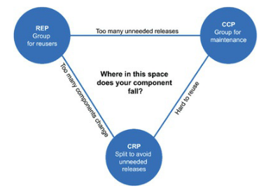

## Component Cohesion
> coesão de componentes é a determinação de quais classes pertencem a quais
componentes
  - REP: princípio da equivalência do reúso/release
  - CCP: princípio do fechamento comum
  - CRP: princípio do reúso comum

### O Princípio da Equivalência do Reúso/Release
> *a granularidade do reúso é a granularidade do release*

  - os componentes devem ser formados de classes que pertençam a um grupo coeso,
  ou seja, não simplesmente agruparmos diversas classes *"util"* e compilar uma
  biblioteca
  - não simplesmente agrupar um grupo coeso como também devem ser passíveis de
  release em conjunto. compartilham a mesma versão e o mesmo rastreio de
  release.
  - é fácil identificar quando um componente não foi desenvolvido de maneira
  coesa pois as classes que "não fazem sentido" serão facilmente identificadas
  - o ponto fraco do REP é compensado pela força dos CCP e do CRP

### O Princípio do Fechamento Comum
> reúna em componentes as classes que mudam pelas mesmas razões e nos mesmos
momentos. separe em componentes diferentes as classes que mudam em momentos
diferentes e por diferentes razões.

  - análogo ao SRP (Single Responsibility Principle) mas com aplicabilidade aos
  componentes. componentes não devem ter várias razões para mudar.
  - classes e módulos que são fortemente ligados ou que mudam sempre juntos,
  então pertencem ao mesmo componente.
  - a coesão habilitará que façamos mudanças menos impactantes, com menos
  revalidações e reimplantações
  - também análogo ao OCP pois os componentes são devem ser estratégicamente
  fechados para modificações e aberto para extensões

### O Princípio do Reúso Comum
> não force os usuários de um componente a dependerem de coisas que eles não
precisam

  - classes e módulos que tendem a ser utilizados juntos, devem pertencer ao
  mesmo componente
  - essas mesmas classes devem ter várias dependências entre si
  - nos diz respeito aos módulos e classes que não devem ser reunidas. por
  exemplo quando um componente depende de outro, que seja apenas um classe
  sequer, temos uma dependência. ela provavelmente fará que uma reação seja
  desencadeada: revalidar e reimplantar múltiples componentes
  - análogo ao ISP: não dependa de coisas que você não precisa

### O Diagrama de Tensão para Coesão de Componentes
> o diagrama visa equilibrar o uso dos princípios abordados nesse capítulo a
partir da avaliação dos problemas que a aplicação vier a apresentar e a
adaptação/aplicação dos conceitos a sua aplicação deve ser de acordo com as
**demandas atuais da equipe**

## Conclusão
  - no passado os componentes chegaram a ser criados por simplesmente
  compartilharem as mesmas variáveis. no entanto a coesão de componentes não se
  trata disso mas sim de entender os 3 conceitos e aplicar de acordo com as
  demandas atuais, e isso definitivamente não é uma habilidade trivial. a
  mudança é dinâmica, uma demanda hoje pode não ser a mesma amanhã, mês que vem
  ou no próximo ano.

