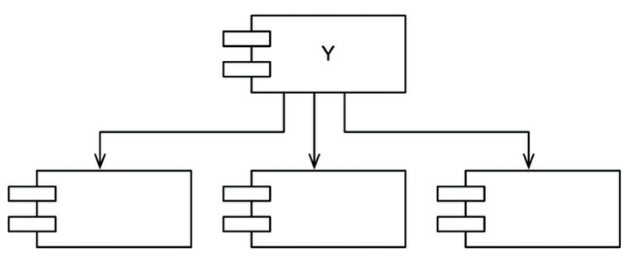
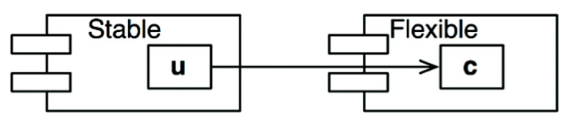
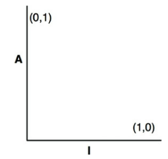
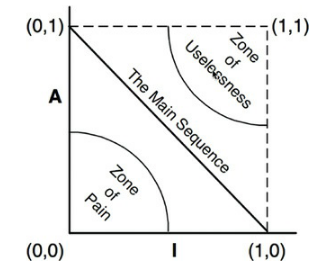
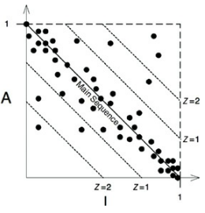

## Component Coupling
> esse capítulo aborda a tensão entre a capacidade de desenvolvimento e design
lógico, assim como no anterior

### O Princípio das Dependências Acíclicas
> não permita ciclos no grafo de dependências
  - trataremos dos percalços que ter mais desenvolvedores do que a demanda do
  projeto pede. com isso, a "síndrome da manhã seguinte" passa a assolar os
  desenvolvedores que desenvolvem ao mesmo tempo. gerando muitos conflitos.
  - pode causar inconsistência no build, passando semanas sem que um estável
  seja liberado.

**Build semanal**
  - múltiplos desenvolvedores atuando separadamente para integrar ao final da
  semana, até a gestão adotar o build/release quinzenal, tal qual a problemática
  dessa abordagem.
  - a crise é iminente. o projeto evolui, o cronograma aumenta, a integração e
  os testes ficam cada vez mais difíceis, não há feedback contínuo.

**Eliminando Ciclos de Dependências**
  - as equipes são particionadas, os fontes são estudados e agrupados a fim de
  componentizarmos, as equipes que trabalham com dependências usam a release
  atual, ainda que a próxima release esteja em desenvolvimento com a opção de
  decidir se a utilizarão. todas equipes trabalham, mesmo que separadamente, e
  não ficam a mercê umas das outras. a integração passa a ocorrer em blocos
  menores mas com consistência.
  - ao final da integração dos grupos menores, estes mesmos - em forma de
  componente - passam pelo mesmo processo para formar uma só aplicação
  - esse tipo de projeto comumente apresenta ser um DAG - Directed Acyclic
  Graph) ou grafo cíclico direcionado

### O Efeito de um Ciclo Sobre o Grafo de Dependência de Componentes
  - módulos naturalmente dependerão uns dos outros, o problema é que
  eventualmente para liberar a release do componente X precisaremos da nova
  release do componente Y, que está recém liberada mas os desenvolvedores
  não atualizaram até então. o acoplamento preocupa e gera dependências também
  na atualização, em que X, depende de Y, e Z depende de X. uma ordem deve ser
  estabelecida para as atualizações.

**Quebrando o Ciclo**
  - para quebrar o DAG podemos tomar duas abordagens:
    1. aplicar o DIP e incluir interfaces entre os módulos
    2. crie um novo módulo em que Y e Z dependam (seguindo o cenário abordado
       anteriormente). e mova as classes que ambos dependem para esse módulo

**As "Variações"**
  - a segunda opção sugere que a estrutura de componentes é volátil à alterações
  de requisitos. mas não é a única opção. ela faz com que a estrutura de
  dependências cresça.
  - a cada vez que o DAG for identificado, ele precisa ser quebrado, a análise
  do projeto e dos desenvolvedores dirá se a melhor abordagem é a opção 1 ou 2.

### Design de Cima para Baixo
  - o diagrama de estrutura de dependência de componentes não deve ser uma das primeiras
  coisas a serem feitas num projeto. apesar disso parecer contraintuitivo.
  - eles são mapas para facilitar o build e manutenção da aplicação. nessa
  estrutura a principal preocupação é com o isolamento e volatilidade. não
  queremos que componentes que mudam com frequencia afetem componentes estáveis.
  - esse diagrama não deve ser criado no início pois não sabemos das
  interdependências entre classes/módulos e não haveria como prever tudo isso no
  início. seria um fracasso.

**O Princípio das Dependências Estáveis**
> dependa da direção da estabilidade
  - um componente estável não deve ser dependente de um volátil. caso contrário,
  o componente volátil será difícil de mudar.
  - ao aplicar o SDP (Stable Dependency Principle) garantimos que módulos
  difíceis de alterar não sejam dependentes dos fáceis de alterar.

**Estabilidade**
  - X é estável e tem 3 boas razões para não mudar; X é responsável por outros 3
  componentes e também independente pois não há classe em que X dependa
  

  - Y é instável e depende de outros 3 componentes; Y não é responsável por nenhum
  outro componente, é dependente e também pode sofrer com mudanças vindas de
  fontes externas.
  

**Métricas de Estabilidade**
  - podemos calcular a partir do número de dependências que entram e saem do
  componente.
  - fan-in: dependências entrando
  - fan-out: dependências saindo
  - *I* - Instabilidade: fan-in + fan-out. 0 estabilidade máxima e 1 instabilidade
  máxima
  - SDP diz que a métrica *I* de um componente deve ser maior que a métrica *I* dos
  componentes que ele depende

**Nem Todos os Componentes Devem ser Estáveis**
  - não há como todos os componentes serem estáveis num sistema. idealmente os
  mutáveis estarão no topo, dependendo dos estáveis logo abaixo.
  - para solucionar uma violação SDP na qual uma classe estável depende de uma
  classe de um component mutável, aplicamos DIP. colocamos uma interface entre
  as duas classes e extraia para essa interface todos os métodos em que a
  classe estável precisa usar.
  

**Componentes Abstratos**
  - extrair de uma classe concreta alguns métodos e transformar num componente é
  algo que parece absurdo. mas é uma tática para linguagens estaticamente
  tipadas.

### O Princípio de Abstrações Estáveis
> Um componente deve ser tão abstrato quanto estável

**Onde Devemos Colocar as Políticas de Alto Nível**
  - políticas de alto nível devem ser aplicadas pensando em OCP, em que classes são
  flexíveis o bastante para serem extendidas sem modificações. classes abstratas
  são o ideal para isso.

**Apresentando o Princípio de Abstrações Estáveis**
  - para SAP um componente estável deve ser abstrato para que sua estabilidade
  não impeça sua extensão. já um instável deve ser concreto.
  - portanto, um componente estável deve consistir de interfaces e classes
  abstratas. estes mesmos componentes são extensíveis, flexíveis e não
  restringem demais a arquitetura.

**Medindo a Abstração**
  - sua métrica é a razão entre interfaces e classes abstratas de um componente
  e o número total de classes desse mesmo.
  - *Nc*: número de classes
  - *Na*: número de classes abstratas
  - *A*: nível de abstração. *A* = *Na* / *Nc*. 0 indica que não há classes
  abstratas e 1 que contém apenas esse tipo de classe.

**A Sequência Principal**
  - e distribuimos os componentes no gráfico

  
  

**A Zona da Dor**
  - um exemplo comum de classes que ficam na zona da dor são os esquemas de
  bases de dados. são voláteis, concretos e alvos frequentes de dependências.

**A Zona da Inutilidade**
  - um exemplo são restos de classes abstratas nunca implementados. são inúteis
  e eventualmente os encontramos na base de código.

**Evitando  as Zonas de Exclusão**
  - é extremamente desejável que os componentes estejam próximos as extremidades
  da *sequência principal*. a linha que cruza de (1,0) a (0,1)

**Distância da Sequência Principal**
  - para determinar a distância do componente das duas zonas indesejadas,
  calculamos *D*
  - *D*: *A* + *I* - 1. 1 indica que está distânte da sequência principal e 0
  indica que está diretamente na sequência principal.
  

## Conclusão
  - as métricas de gestão de dependências descritas no capítulo estão em
  conformidade com o que Uncle Bob considera "bom". não são perfeitas e tampouco
  imutáveis. mas refletem a sua experiência com dependências boas ou ruins.

