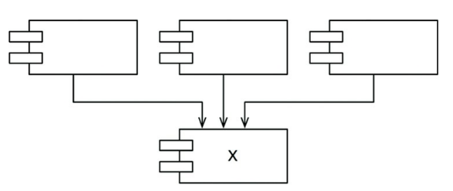

## Component Coupling
> esse capítulo aborda a tensão entre a capacidade de desenvolvimento e design
lógico, assim como no anterior

### O Princípio das Dependências Acíclicas
> não permita ciclos no grafo de dependências
  - trataremos dos percalços que ter mais desenvolvedores do que a demanda do
  projeto pede. com isso, a "síndrome da manhã seguinte" passa a assolar os
  desenvolvedores que desenvolvem ao mesmo tempo. gerando muitos conflitos.
  - pode causar inconsistência no build, passando semanas sem que um estável
  seja liberado.

**Build semanal**
  - múltiplos desenvolvedores atuando separadamente para integrar ao final da
  semana, até a gestão adotar o build/release quinzenal, tal qual a problemática
  dessa abordagem.
  - a crise é iminente. o projeto evolui, o cronograma aumenta, a integração e
  os testes ficam cada vez mais difíceis, não há feedback contínuo.

**Eliminando Ciclos de Dependências**
  - as equipes são particionadas, os fontes são estudados e agrupados a fim de
  componentizarmos, as equipes que trabalham com dependências usam a release
  atual, ainda que a próxima release esteja em desenvolvimento com a opção de
  decidir se a utilizarão. todas equipes trabalham, mesmo que separadamente, e
  não ficam a mercê umas das outras. a integração passa a ocorrer em blocos
  menores mas com consistência.
  - ao final da integração dos grupos menores, estes mesmos - em forma de
  componente - passam pelo mesmo processo para formar uma só aplicação
  - esse tipo de projeto comumente apresenta ser um DAG - Directed Acyclic
  Graph) ou grafo cíclico direcionado

### O Efeito de um Ciclo Sobre o Grafo de Dependência de Componentes
  - módulos naturalmente dependerão uns dos outros, o problema é que
  eventualmente para liberar a release do componente X precisaremos da nova
  release do componente Y, que está recém liberada mas os desenvolvedores
  não atualizaram até então. o acoplamento preocupa e gera dependências também
  na atualização, em que X, depende de Y, e Z depende de X. uma ordem deve ser
  estabelecida para as atualizações.

**Quebrando o Ciclo**
  - para quebrar o DAG podemos tomar duas abordagens:
    1. aplicar o DIP e incluir interfaces entre os módulos
    2. crie um novo módulo em que Y e Z dependam (seguindo o cenário abordado
       anteriormente). e mova as classes que ambos dependem para esse módulo

**As "Variações"**
  - a segunda opção sugere que a estrutura de componentes é volátil à alterações
  de requisitos. mas não é a única opção. ela faz com que a estrutura de
  dependências cresça.
  - a cada vez que o DAG for identificado, ele precisa ser quebrado, a análise
  do projeto e dos desenvolvedores dirá se a melhor abordagem é a opção 1 ou 2.

### Design de Cima para Baixo
  - o diagrama de estrutura de dependência de componentes não deve ser uma das primeiras
  coisas a serem feitas num projeto. apesar disso parecer contraintuitivo.
  - eles são mapas para facilitar o build e manutenção da aplicação. nessa
  estrutura a principal preocupação é com o isolamento e volatilidade. não
  queremos que componentes que mudam com frequencia afetem componentes estáveis.
  - esse diagrama não deve ser criado no início pois não sabemos das
  interdependências entre classes/módulos e não haveria como prever tudo isso no
  início. seria um fracasso.

**O Princípio das Dependências Estáveis**
> dependa da direção da estabilidade
  - um componente estável não deve ser dependente de um volátil. caso contrário,
  o componente volátil será difícil de mudar.
  - ao aplicar o SDP (Stable Dependency Principle) garantimos que módulos
  difíceis de alterar não sejam dependentes dos fáceis de alterar.

**Estabilidade**
  - X é estável e tem 3 boas razões para não mudar; X é responsável por outros 3
  componentes e também independente pois não há classe em que X dependa
  

  - Y é instável e depende de outros 3 componentes; Y não é responsável por nenhum
  outro componente, é dependente e também pode sofrer com mudanças vindas de
  fontes externas.

**Métricas de Estabilidade**

**Nem Todos os Componentes Devem ser Estáveis**

**Componentes Abstratos**

### O Princípio de Abstrações Estáveis
> Um componente deve ser tão abstrato quanto estável

**Onde Devemos Colocar as Políticas de Alto Nível**

**Apresentando o Princípio de Abstrações Estáveis**

**Medindo a Abstração**

**A Sequência Principal**

**A Zona da Dor**

**A Zona da Inutilidade**

**Evitando  as Zonas de Exclusão**

**Distância da Sequência Principal**

## Conclusão

