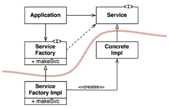

## Dependency Inversion Principle
> a inversão de dependência consiste em depender de interfaces e declarações que
não sejam influeciadas por implementações. a "inversão" em si trata-se do fluxo,
pois uma classe concreta referencia uma abstração que é dependência de outra já
com as implementações (e não o contrário).
por exemplo: *Main* -> *AService* -> *AServiceImpl*

### Abstrações Estáveis
  - em resumo, não precisamos depender de abstrações cujas implementações são
  estáveis. um exemplo disso seria um interface de `String` em java.
  seria desnecessário.

  - boas práticas de arquiteturas estáveis:
    - não se refira a classes concretas voláteis;
    - não derive de classes concretas voláteis;
    - não sobreescreva funções concretas;
    - nunca mencione o nome de algo que seja concreto e volátil.

### Factories
  - não há como elimitar por completo as referencias a classes concretas e
  voláteis. há como driblarmos isso usando o *pattern* `factory` cujos detalhes
  importantes para instanciarmos classes concretas serão "separados" dos fontes
  principais. [no exemplo da figura 11.1](#dependency-inversion-principle) temos
  que a classe `Application` acessa uma factory para intanciar uma implementação
  de uma de suas dependências: `Service`.

## Conclusão
  - DIP é uma espécie de organizador de diagramas de arquitetura, seu objetivo é
  propiciar menor acoplamento entre as classes propondo o uso de interfaces que
  determinam os contratos entre o que é necessário e o que será provido

