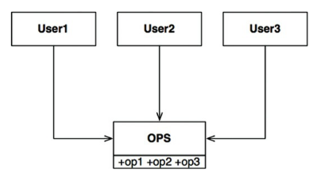
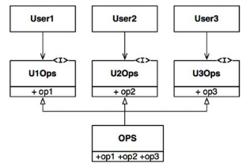

## Interface Segregation Principle
> a segregação de interfaces se baseia em não depender de métodos que não são
necessários ou usados pois, essencialmente, linguagens estativamente tipadas
precisarão ser recompiladas e passar por reimplatação. um módulo mal segregado
resultará em compilações desnecessárias.

### Exemplo de segregação
  - usuário1, usuário2, usuário3 usam respectivamente a função1, função2 e
  função3 da classe OPS

  - tendo casos de uso bem definidos como descrito, não há motivo para esses
  métodos continuarem numa mesma classe

  - após a separação das funções de acordo com cada usuário/caso de uso teremos
  o seguinte resultado

### Arquitetura
  - o mesmo pode e deve se aplicar à arquitetura de sistemas. reduzindo
  bibliotecas desnecessárias e/ou módulos nessas mesmas que não sejam usados,
  contanto que não sejam dependência trânsitiva

## Conclusão
  - depender de algo que contém itens desnecessários ou até mesmo dependências
  trânsitivas também dispensáveis pode acarretar em problemas inesperados. o
  tema ISP é bastante ligado à coesão de componentes

