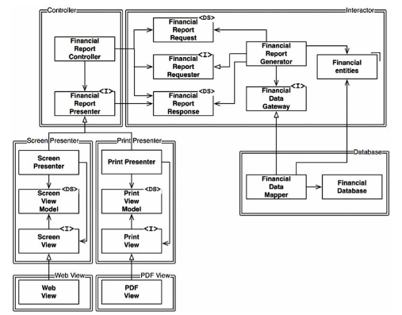

## Open-Closed Principle
  - desenvolvido em 1988 o OCP diz que *um artefato de software deve ser aberto para
  extensão e fechado para modificação*
  - um cenário de exemplo é o seguinte:
    - temos um software que imprime em preto e branco de maneira XYZ, porém,
    precisamos acrescentar rodapés em formato losangular ao invés dos antigos traços
    - quando do código anterior terá que mudar? o ideal é que seja ZERO. apesar de difícil, é
    possível e a arquitetura de software diz que quanto melhor a separação, melhor segregada
    a responsabilidade, mais fácil fica para alcançarmos o ideal.

### Controle direcional e Ocultando Informações
  - OCP visa o controle de mudanças de acordo com a direção em que as interfaces e suas
  implementações estão. uma interface tem como objetivo definir um acordo/ regra de negócio entre
  a classe X e Y, então uma função com uma determinada assinatura e retorno não será alterada.
  isso em partes já garante mínima à nenhuma mudança na classes de hierarquia mais alta.
  - já quanto a ocultação de informações é também sobre intefaces, sobre a proteção que a
  mesma promove as classes que as referenciam. isso inclusive desacopla possíveis dependências
  transitivas. que ferem o princípio geral de que entidades não dependem do que não usam diretamente.

  - em termos de "controle direcional" a interface *FinancialDataGateway* existe para inverter a dependência
  entre *FinancialReportGenerator* e *FinancialDataMapper*, onde a primeira referencia a interface e a
  segunda implementa a interface.

  - em termos de "ocultação de informação" temos que a interface *FinancialReportRequester* protege
  *FinancialReportController* defende a de hierarquia mais alta de mudanças na de hierarquia
  mais baixa. consequentemente a primeira desconhece as dependências da classe que implementa essa
  interface.

## Conclusão
  - para evoluir um sistema de forma fácil, compreensível e sem alto impacto, utilizamos OCP para segregar
  responsabilidades, componentizar o sistema e organizar a hierarquia de dependências. dessa forma
  componentes de nível mais alto estão protegidos de mudanças em componentes de nível mais baixo

