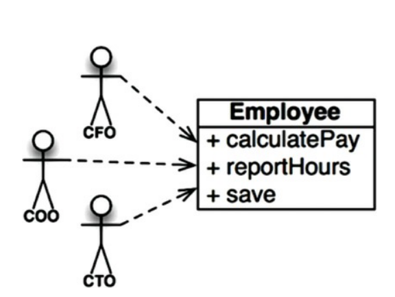
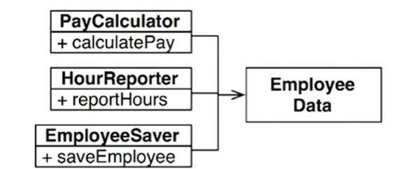
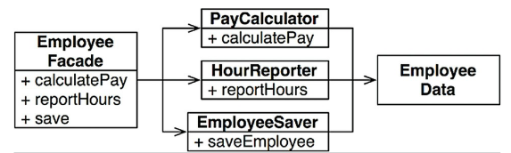
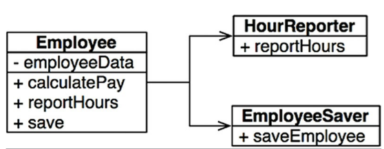

## Single Responsibility Pattern
  - um módulo deve ser responsável por um, e apenas um, ator
    - em outras palavras, stakeholders diferentes não podem mudar o mesmo módulo
  - atributo principal do SRP: coesão. pois sugere que esta é a amarra entre código e o ator.

### Sintomas de violação do SRP
#### Duplicação Acidental

 - cada ator está sendo associado à uma função, isso é um problema grave pois implementações ou
 mudanças incentivadas por um dos atores, pode e provavelmente vai interferir negativamente nas
 funções dos demais atores.

#### Fusões

 - se trata, em poucas palavras, da colisão de mudanças nos fontes. como se mudanças feitas para
 atender atores diferentes que atingem os mesmos trechos de código, gerando alto risco de que
 as mudanças feitas para atender X ou por Y interfiram negativamente um deles, ou talvez ambos.

### Soluções
 - basicamente podemos resolver o problema desacoplando a classe, ou seja, segregando uma classe
 com N funções em N classes com 1 função. reunindo o uso das suas funções em 1 classe, por exemplo
 a responsável por agregar os resultados.

  - essa solução traz um problema que é a adição de 3 novas classes para rastrear

  - outra opção é agregar a um facade

  - contudo ainda há a opção de aproximar tudo às regras de negócio

## Conclusão
  - O SRP trata de funções e classes em 2 níveis:
    - componentes: common closure principle (CCP) - alterações só interferem nas classes do componente
      alterado, e nada além
    - arquitetura: determina os limites arquiteturais

