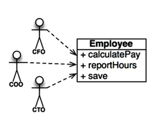

## Single Responsibility Pattern
  - um módulo deve ser responsável por um, e apenas um, ator
    - em outras palavras, stakeholders diferentes não podem mudar o mesmo módulo
  - atributo principal do SRP: coesão. pois sugere que está a amarra entre código e responsável.

### Sintomas de violação do SRP
### Duplicação Acidental

