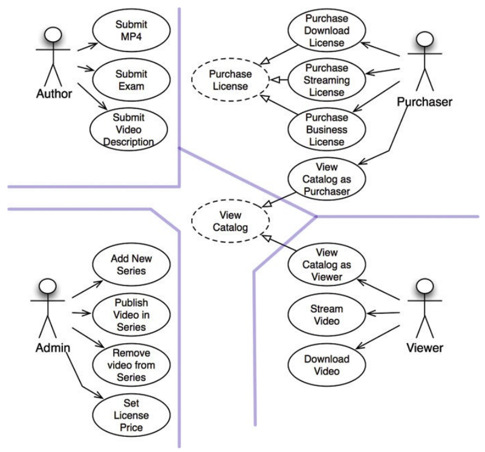

## Estudo de Caso: Vendas de Vídeo

### Produto
- sistema de venda de vídeos para pessoas físicas e jurídicas
- podem comprar e baixar, por um preço mais alto. ou comprar para realizar
streaming
- licenças para pessoas jurídicas devem ser apenas de streaming e devem ser
compradas em lote e permitem descontos por quantidade
- usuários interagem como espectadores e compradores
- administradores gerenciam os vídeos e determinam os preços

### Análise do Caso de Uso
- vamos determinar a arquitetura inicial a partir dos casos de uso e atores
- o objetivo dessa caso de uso não é ser exaustivo, não haveram detalhes como
*log-in* e *log-out* dos atores
- de acordo com SRP esses atores são fonte primária para mudanças no sistema

### Arquitetura de Componente
- cada retangulo representa um componente, linhas duplas representam limites
arquiteturais

- *eu deveria realmente o sistema em todos esses componentes e entregá-los em
arquivos .jar ou .dll? sim e não. eu certamente dividiria a compilação e criaria
um ambiente dessa maneira para que eu pudesse criar produtos independentes como
esses.*
- como a arquitetura está disposta seria fácil combinar em cinco arquivos
(visualizações, apresentadores, interações, controladores e utilidades)
- outra alternativa seria reuniar visualizações e apresentadores, e os demais em
um outro componente

### Gestão de Dependência
- a figura 33.2 está seguindo a regra de dependências, onde os componentes de
nível mais baixo cruzam limites para os de nível mais alto. flechas apontam da
esquerda para direita
- para atender o OCP e impedir que mudanças no nível mais baixo reflitam em
políticas de nível mais alto:
  - relacionamentos de dependências: flechas abertas apontam para a direção do
  fluxo de controle
  - relacionamentos de herança: flechas fechadas apontam no contra fluxo de
  controle

## Conclusão
- o caso de uso visa atender os requisitos inicialmente com SRP e depois com a
regra de dependência. separando componentes que mudam por razões diferentes e em
ritmos diferentes. onde as razões são os atores e ritmos são os níveis de
política

